# Production DSP Platform Branch Explainer

This document explains what the `production-dsp-platform` branch adds, how the main systems work from the UI down to the audio engine, why the branch is large, and which existing paths it replaces or preserves.

## Start here: what this product is

A **DAW**, or digital audio workstation, is a place to record, arrange, edit, process, and export sound. This project puts that workstation in a browser. A person can create tracks, place clips on a timeline, turn effects on and off, record from a microphone, collaborate on shared projects, and export a mix without installing a traditional desktop DAW.

The **production DSP platform** is the part of this branch that makes those actions dependable. DSP means **digital signal processing**, the calculations that change audio. The platform connects the visible controls to live browser audio, recording, offline export, persistence, collaboration, undo, timing, and failure recovery. It exists so that “turn this knob” means the same thing to the user, the saved project, playback, and the exported file.

It is for musicians making audio, collaborators sharing a project, and product, design, and engineering teams building the workstation. The user should not need to know any of the technical terms in this document. Their expected experience is simple: make a change, hear it quickly, trust that it is saved, undo it if needed, and receive a clear explanation if something cannot finish.

### A studio mental model

Think of the application as a small recording studio:

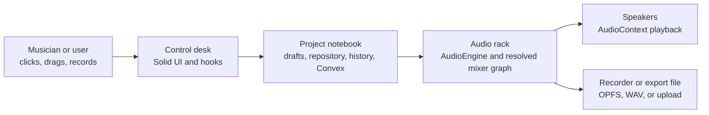

**What to notice:** one user action can affect three destinations: the sound playing now, the project remembered for later, and a recorded or exported file. The platform keeps those destinations consistent.

| Studio analogy | Real code layer | Job |
| --- | --- | --- |
| Musician | User input and browser events | Requests a change |
| Control desk | `src/components/`, `src/hooks/` | Shows controls and turns gestures into domain updates |
| Project notebook | `src/lib/`, local repositories, `api/`, `convex/` | Stores, validates, shares, and undoes project state |
| Audio rack | `AudioEngine`, `packages/audio-engine/` | Builds and updates the live or offline signal path |
| Speakers | `AudioContext` and native Web Audio nodes | Plays the result now |
| Recorder or export file | Recording workers, OPFS, `run-export-job.ts` | Captures or renders a durable result |

This analogy is only a map. The real system has separate ownership and validation rules, which the later sections explain.

## The story of the system on one page

Start with this picture before learning any terminology:

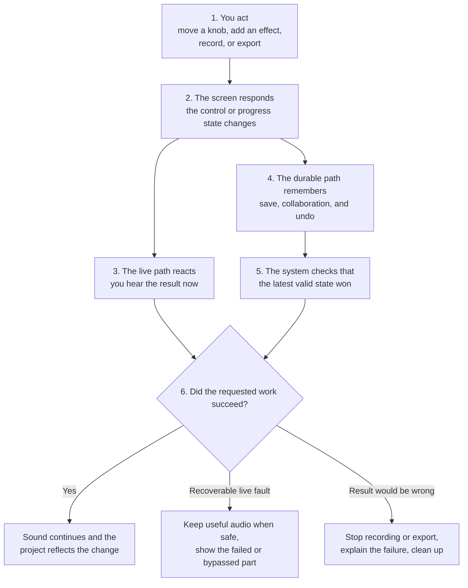

**What to notice:** the live sound and the saved project travel on separate paths, then reconcile around one exact target. A slow save should not delay a knob, but a failed export must not pretend to be correct.

### The beginner reading lane

Read only these sections for a product-level understanding:

1. [Start here](#start-here-what-this-product-is)
2. [The story of the system on one page](#the-story-of-the-system-on-one-page)
3. [Everyday studio scenarios](#everyday-studio-scenarios)
4. [Before and after: small actions](#before-and-after-small-actions)
5. [What the user sees across longer jobs](#what-the-user-sees-across-longer-jobs)
6. [Failure states and recovery](#11-failure-states-and-recovery)
7. [Summary](#summary)

You can stop there. File names, function names, complexity notation, processor construction, and schema details are optional.

### The optional engineering deep-dive lane

After the beginner lane, engineers can continue through sections 1 to 15. Those sections preserve exact files, contracts, identities, lifecycle rules, and validation behavior. Code blocks and paths are evidence for implementation readers, not prerequisites for understanding the product.

## Guided tour by role

You do not need to read this document linearly. Pick the route that matches your role:

| If you are a... | Read these sections in order | You will learn |
| --- | --- | --- |
| Product person | [Start here](#start-here-what-this-product-is) → [Before and after](#before-and-after-small-actions) → [End-to-end production flows](#14-end-to-end-production-flows) → [Summary](#summary) | What users can do and what the branch makes reliable |
| Designer | [Studio mental model](#a-studio-mental-model) → [Visual glossary](#visual-glossary) → [Effect UI to AudioWorklet](#2-effect-ui-to-audioworklet) → [Failure states and recovery](#11-failure-states-and-recovery) | What each control changes and what states need visible feedback |
| Frontend engineer | [System overview](#system-overview) → [Effect UI to AudioWorklet](#2-effect-ui-to-audioworklet) → [Undo, selection, and reactive ownership](#9-undo-selection-and-reactive-ownership) | How UI state, ownership, history, and engine synchronization fit together |
| Backend engineer | [Core architecture change](#1-core-architecture-change) → [Local-first versus shared persistence](#local-first-versus-shared-persistence) → [Shared timeline contracts](#shared-timeline-contracts) → [Failure states and recovery](#11-failure-states-and-recovery) | How operations, repositories, validation, retries, and snapshots protect state |
| Audio engineer | [Visual glossary](#visual-glossary) → [Mixer, routing, and delay compensation](#3-mixer-routing-and-delay-compensation) → [New DSP processors](#7-new-dsp-processors) → [Export pipeline](#5-export-pipeline) | How the graph, processors, latency, routing, and offline render relate |

## Everyday studio scenarios

### Taming a loud vocal

A singer has a few words that jump out much louder than the rest. A compressor can gently reduce those peaks, and a limiter can stop the final mix from crossing a hard ceiling.

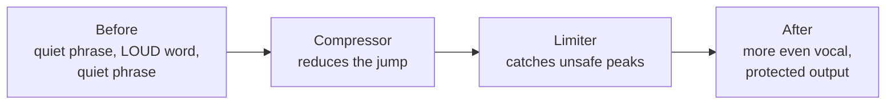

**What to notice:** the compressor shapes musical dynamics, while the limiter is the final safety boundary. They are separate effect instances with separate settings and identities.

### Letting drums make room for bass

A bass sound may fill the same moment as a kick drum. Sidechain compression lets the kick control the bass compressor, briefly lowering the bass whenever the kick hits.

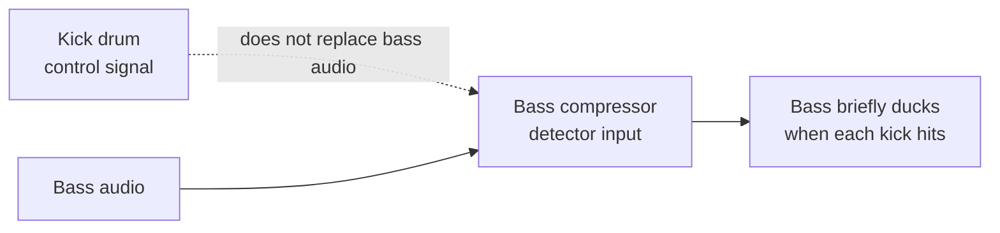

**What to notice:** the kick is a control input to one exact compressor instance. The bass still supplies the audio being heard.

### Automating a filter sweep

Instead of turning a filter knob by hand throughout playback, the user can draw how the value should move over time.

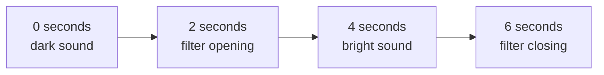

**What to notice:** automation is a saved timeline for one exact parameter. Touching that knob manually overrides the scheduled value for that target rather than guessing which filter the user meant.

## Branch scope

Compared with `origin/master`, the branch currently changes **227 files**, with **26,326 additions** and **2,734 deletions**.

The branch is not 20,000 lines of DSP algorithms. A substantial portion covers tests, persistence, collaboration, recording ownership, export fidelity, and browser characterization.

## Table of contents

- [Branch scope](#branch-scope)
- [Start here: what this product is](#start-here-what-this-product-is)
- [The story of the system on one page](#the-story-of-the-system-on-one-page)
- [Guided tour by role](#guided-tour-by-role)
- [Everyday studio scenarios](#everyday-studio-scenarios)
- [System overview](#system-overview)
- [Visual glossary](#visual-glossary)
- [Before and after: small actions](#before-and-after-small-actions)
- [What the user sees across longer jobs](#what-the-user-sees-across-longer-jobs)
- [Core architecture change](#1-core-architecture-change)
- [Effect UI to AudioWorklet](#2-effect-ui-to-audioworklet)
  - [AutoFilter knob walkthrough](#autofilter-knob-walkthrough)
  - [What happens during a held drag](#what-happens-during-a-held-drag)
  - [What happens at pointer-up](#what-happens-at-pointer-up)
- [Mixer, routing, and delay compensation](#3-mixer-routing-and-delay-compensation)
- [Production recording](#4-production-recording)
- [Export pipeline](#5-export-pipeline)
- [New DSP processors](#7-new-dsp-processors)
- [Automation identity and scheduling](#6-automation-identity-and-scheduling)
- [Undo, selection, and reactive ownership](#9-undo-selection-and-reactive-ownership)
- [Complexity and resource limits](#10-complexity-and-resource-limits)
- [Failure states and recovery](#11-failure-states-and-recovery)
- [Shared timeline contracts](#shared-timeline-contracts)
- [Diagnostics and reliability](#12-diagnostics-and-reliability)
- [What is replaced?](#13-what-is-replaced)
- [End-to-end production flows](#14-end-to-end-production-flows)
- [Why is it so much code?](#15-why-is-it-so-much-code)
- [Rendering decision](#rendering-decision)
- [Summary](#summary)

## System overview

```text
Solid UI
  ↓
Draft state, persistence, history, and collaboration
  ↓
AudioEngine facade
  ↓
Resolved mixer graph and timing policy
  ↓
Live AudioContext or OfflineAudioContext
  ↓
Native Web Audio nodes and static AudioWorklets
  ↓
Speakers, recording storage, or exported files
```

`AudioEngine` remains the application-facing facade. The major changes are beneath it: stable processor identity, explicit routing, delay compensation, bounded recording, live/offline parity, and versioned processor ownership.

## Visual glossary

| Term | Plain-language meaning | Where to look |
| --- | --- | --- |
| **Track** | A lane that owns clips, volume, routing, and usually effects. | `TimelineTrackRow` in `src/lib/timeline-repository/types.ts` |
| **Effect** | A kind of audio processor, such as EQ, compressor, or reverb. | `AudioEffectKind` and `AUDIO_EFFECT_CONTRACTS` in `packages/shared/src/effects-params.ts` |
| **Effect instance** | One placed copy of an effect. Two compressors are two instances, even if they have the same kind. | `AudioEffectInstance.instanceId` and ordered runtime instances |
| **Parameter** | One setting on an effect, such as compressor threshold or filter frequency. | Effect parameter envelopes and automation descriptors |
| **Automation** | A timeline of parameter values that changes while the project plays. | `packages/shared/src/automation.ts` |
| **Audio graph** | The connected route that audio follows from sources through processing to an output. | `resolveMixerGraph` and live/offline routing |
| **AudioNode** | A browser Web Audio building block with inputs and outputs. | Native nodes such as `GainNode`, `BiquadFilterNode`, and `DelayNode` |
| **AudioWorklet** | A browser extension point for custom audio code that runs in the audio rendering system. | `public/audio-worklets/` and `static-worklet-chain.ts` |
| **DSP** | The math that transforms audio samples. | `packages/audio-engine/` and checked-in worklet processors |
| **Routing** | Deciding where a track's output goes. | `TrackRouting`, `outputTargetId`, and `sends` |
| **Send** | A copy of a track's signal sent to another channel, with a chosen tap point. | `TrackRouting.sends` and `pre-fx`, `pre-fader`, `post-fader` |
| **Sidechain** | A control signal from one track that influences an effect on another track. | `ExternalSidechainRoute` and `sidechains.setRoute` |
| **Latency** | Delay between an input and the resulting sound. | Processor latency declarations and compensation in `resolveMixerTiming` |
| **Local project** | A project saved in this browser, primarily through IndexedDB, OPFS, and local repositories. | `src/lib/timeline-repository/` and local project storage |
| **Shared project** | A project whose durable operations are authorized and synchronized through the Worker API and Convex. | `publishDurableSharedTimelineOperation`, `api/`, and `convex/` |
| **Undo snapshot** | A saved description of related entities that can restore an earlier state. | `src/lib/undo/builders.ts` and `TimelineSnapshot` |

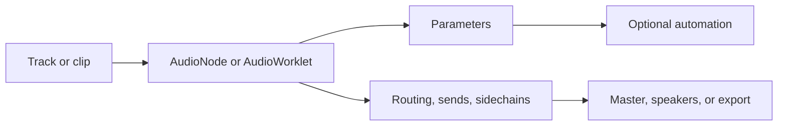

**What to notice:** sound moves through processors, while parameters, automation, and routing describe how those processors behave and where the result goes.

### Shared timeline contracts

The shared operation contract is the language used when a local or shared edit crosses a boundary. For example, `packages/shared/src/shared-timeline-operations.ts` defines `effects.setCompressorParams` with an `instanceId`, `tracks.setRouting` with sends, and `sidechains.setRoute` with `sourceTrackId`, `targetTrackId`, and `effectInstanceId`. The repository contract in `src/lib/timeline-repository/types.ts` exposes the same ideas through `TimelineSnapshot`, `setSidechainRoute`, and `removeSidechainRoute`.

That means the operation is not “change whichever compressor is first.” It is “change this exact instance on this exact target,” which is important for collaboration, undo, and recovery.

## Before and after: small actions

These examples show the difference between a user's simple action and the state that the system must keep aligned. “Before” means before the action, not an obsolete legacy implementation.

### Adding an effect to a track

| Before | After |
| --- | --- |
| The track has an ordered chain without the new effect. | The chain contains a new effect instance with a durable `instanceId`; the UI, engine, history, and persistence all know where it belongs. |

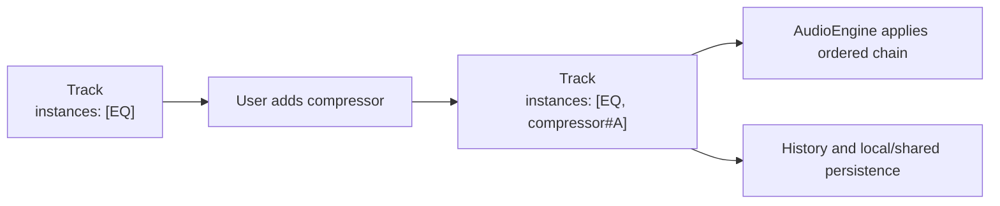

**What to notice:** adding an effect creates a named, ordered instance. It is not merely a temporary panel appearing on screen.

### Moving a knob

| Before | During and after |
| --- | --- |
| The knob shows the current parameter value. | A drag clamps and quantizes a new value, updates the live engine immediately, then persists the instance-keyed change. Pointer-up cleans up the gesture; it is not a second audio commit. |

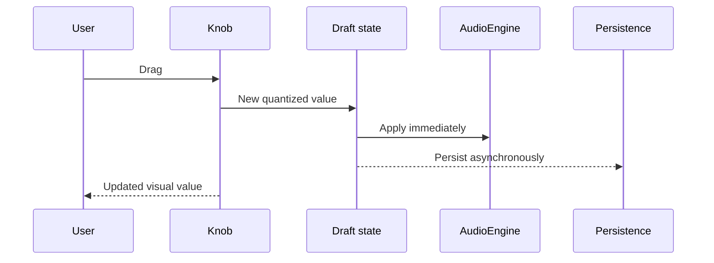

**What to notice:** the visual control and live sound update on the immediate path. Saving is a separate asynchronous path and does not wait for pointer-up.

#### What happens instantly versus afterward

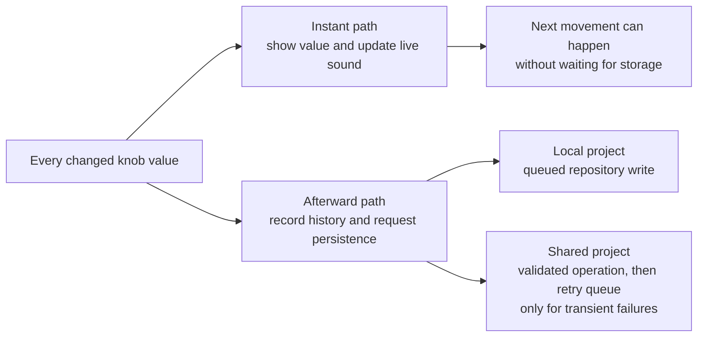

**What to notice:** “afterward” does not mean “only when the drag ends.” Each normalized changed value can start persistence while the next movement continues.

### Two instances of the same effect

| Without instance identity | With instance identity |
| --- | --- |
| “Compressor threshold” could refer to either compressor. Reordering or undo could change the meaning. | `compressor#A` and `compressor#B` remain distinct through parameters, automation, routing, undo, and export. |

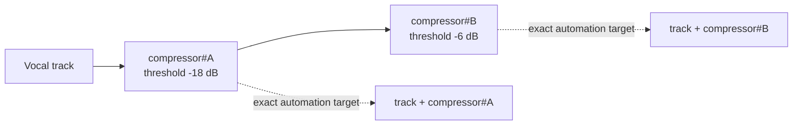

**What to notice:** order tells us which processor runs first, while `instanceId` tells us which exact processor owns a setting, automation lane, sidechain, or undo entry.

### Adding a sidechain route

| Before | After |
| --- | --- |
| The compressor has no external detector input. | A source track feeds the detector of a specific target effect instance. The operation validates both tracks and the effect identity before the graph connects. |

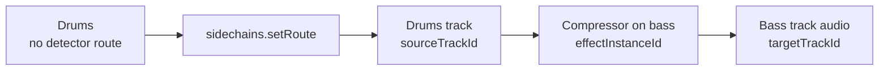

**What to notice:** the route names a source track, target track, and exact effect instance. Invalid or missing identities are rejected rather than guessed.

### Recording audio

| Before | After |
| --- | --- |
| The timeline has no new recording clip. | The capture path uses the active context when possible, bounded PCM transport, a worker, temporary OPFS storage, WAV encoding, and a new timeline asset and clip. `MediaRecorder` remains a labeled compressed fallback. |

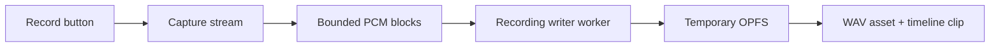

**What to notice:** recording is a bounded stream that becomes a durable asset and clip only after successful finalization.

### Exporting a mix

| Before | After |
| --- | --- |
| The project is editable state in the browser. | A snapshot is rendered through an offline graph, analyzed, processed, encoded, and saved or uploaded. Required DSP failures are visible rather than silently omitted. |

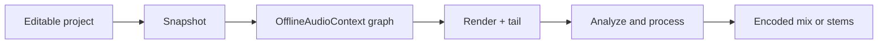

**What to notice:** export starts from a stable snapshot and rebuilds the mix offline. It does not capture whatever happens to be coming from the speakers.

### Undoing a connected edit

| Before undo | After undo |
| --- | --- |
| The latest edit may include an effect, its automation, routing, clips, and sidechain references. | The history entry restores the related state together, validates its identities, and reactive synchronization updates the audio graph. |

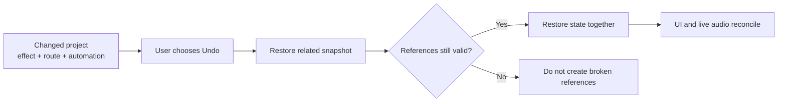

**What to notice:** undo is not a blind screen rewind. It restores connected project state by stable identity and refuses invalid relationships.

## What the user sees across longer jobs

| Situation | Immediate experience | While work continues | Success | Delay or failure | Does audio continue? |
| --- | --- | --- | --- | --- | --- |
| Move a knob | Value and sound respond | Save or shared operation runs separately | Saved state matches what was heard | A persistence error can be surfaced without making the gesture feel stuck | Yes |
| Add or reorder an effect | UI shows the requested chain; graph may rebuild with a short gain transition | A new processor may load and stale builds are discarded | New chain becomes active | Failed live processor is isolated or safely bypassed when policy permits | Usually, through the previous valid or dry path |
| Add a sidechain | Route is requested for one exact instance | Graph validation checks targets and cycles | Source controls the intended detector | Invalid route is rejected; no guessed connection is made | Yes, previous valid graph remains where rollback is supported |
| Record | Recording state begins after capture initializes | Blocks move through a bounded queue to temporary storage | WAV asset and timeline clip appear | Overrun, device loss, or timeout stops capture and reports failure | Playback/monitoring is faded or stopped safely according to the fault |
| Export | Progress begins from a project snapshot | Preload, render, analysis, processing, and encoding advance in stages | Correct file is saved or uploaded | Missing media or required DSP rejects the job visibly | Live playback is separate; the export itself stops |
| Undo | Project state starts restoring | References are validated and persistence completes | UI and sound return to the restored state | Invalid connected references are not partially restored | The engine reconciles to the last valid restored state |

### Recording and export are different promises

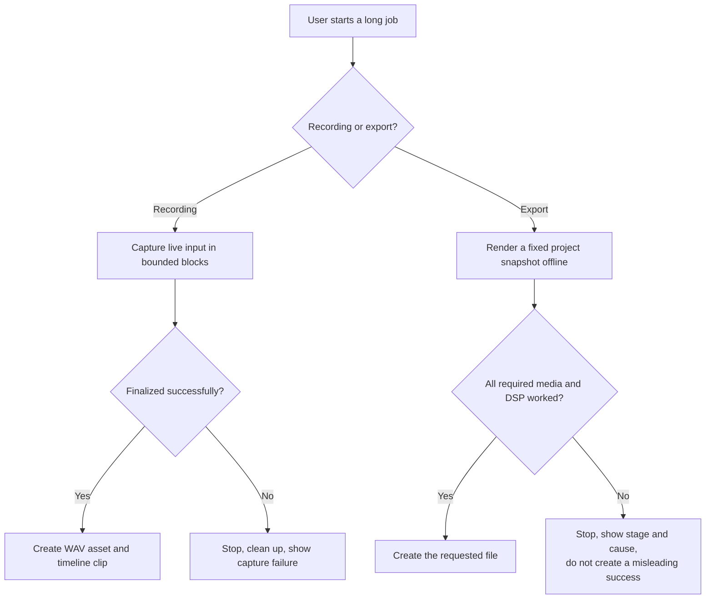

**What to notice:** recording protects captured input and bounded resources. Export protects fidelity. Neither path may silently turn failure into success.
## 1. Core architecture change

> **What you need to know:** A track's sound is not just one effect. It is ordered state plus routing, timing, ownership, and cleanup.
>
> **Why this exists:** The same project must behave consistently while editing, playing, undoing, sharing, and exporting.
>
> **What can go wrong:** A missing identity, invalid route, stale async build, or failed processor can make the graph incorrect or leave resources alive.
>
> **What the user experiences:** Effects stay in the intended order, controls respond quickly, and visible failures are safer than silently changing the sound.

### Before

The original engine largely assumed:

- One effect of each kind per track.
- Automation identified by track and effect kind.
- Relatively simple track-to-master routing.
- Basic `MediaRecorder` recording.
- A simpler offline export path.
- Mostly native Web Audio effects.
- Limited latency, channel-layout, metering, and failure contracts.

Those assumptions become ambiguous when a project contains duplicate compressors, external sidechains, latent processors, pre-fader sends, sample-accurate recording, or offline AudioWorklets.

### After

The central model is now:

```text
Project state
  ↓
Stable effect and instrument instances
  ↓
Canonical resolved mixer graph
  ├── channel layouts
  ├── send tap points
  ├── sidechain edges
  ├── cue routing
  ├── processor timing
  └── delay compensation
       ↓
Live or offline graph adapter
```

The same graph policy drives live playback and offline export.

## 2. Effect UI to AudioWorklet

> **What you need to know:** A knob changes project state; it does not reach into a browser node by itself.
>
> **Why this exists:** One controlled path keeps the visible value, live sound, history, and durable project aligned.
>
> **What can go wrong:** A write can target the wrong track or instance, or a stale graph build can replace a newer edit.
>
> **What the user experiences:** The sound changes during the drag, while saving and collaboration continue separately.

The Spectral effect is a representative example.

### UI

The controls live in:

```text
src/components/effects/Spectral.tsx
```

They expose FFT size, overlap, mode, freeze, gate, morphing, shifting, blur, noise reduction, mix, and sidechain configuration.

The component does not manipulate an `AudioNode` directly. It sends a normalized effect-instance update through the effects-panel state.

### State and persistence

The update passes through:

```text
src/components/timeline/create-effects-panel-audio-effects-state.ts
src/components/timeline/create-effects-panel-state.ts
```

This layer:

1. Updates the optimistic local draft.
2. applies it to the audio engine immediately.
3. Records history and undo state.
4. Persists locally or through Convex.
5. Preserves the stable effect-instance ID.

The same state must be represented across:

```text
packages/shared/src/effects-params.ts
convex/effects.ts
src/lib/local-effects.ts
src/lib/undo/
api/timeline-operation-executor.ts
```

This cross-layer representation is one major reason the branch is large.

### AutoFilter knob walkthrough

Use the AutoFilter frequency knob as a concrete path. The relevant UI call site is:

```text
src/components/effects/AutoFilter.tsx
```

The frequency control is configured with `min={20}`, `max={20000}`, `step={1}`, and `logarithmic`. Every value callback first calls `onManualAutomationOverride("autofilter.frequencyHz")`, then sends `{ frequencyHz }` through the effect component's `onChange` callback. The component does not locate an `AudioNode`, choose a persistence backend, or decide which effect instance owns the value.

The control layers are:

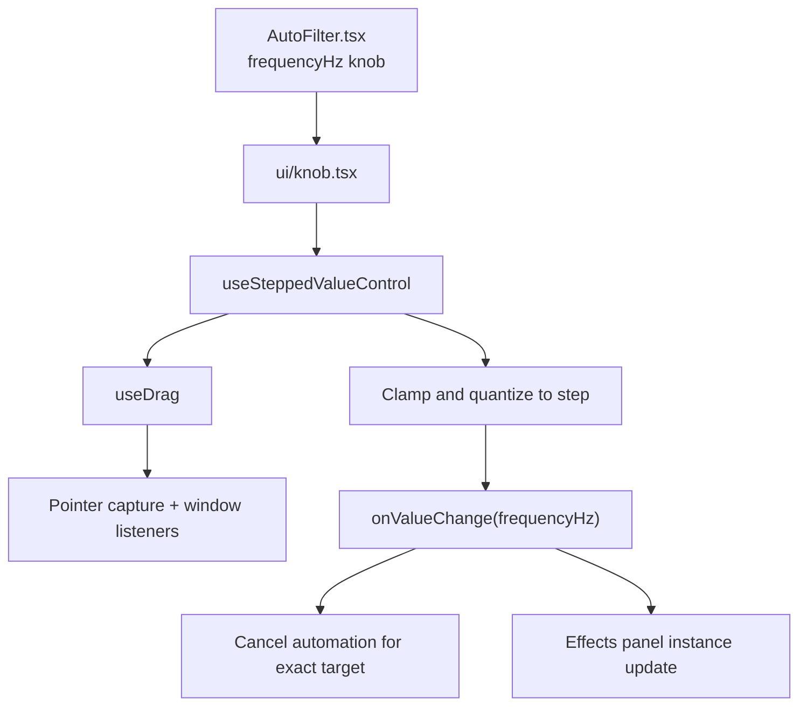

**What to notice:** the control converts pointer motion into a valid parameter value, then hands off one exact instance update. The UI does not search for or directly mutate an audio node.

`Knob.tsx` renders the current value from a temporary drag signal while a drag is active. That signal is visual state only. The durable value still comes from the callback and the instance-keyed state owner.

### What happens during a held drag

1. `Knob` receives `pointerdown`, calls `onAutomationSelect`, and delegates to `useSteppedValueControl`.
2. `useDrag.onPointerDown` checks the disabled accessor, prevents the default browser gesture, captures the pointer where supported, records the pointer ID, adds global `pointermove`, `pointerup`, and `pointercancel` listeners, and marks the body as non-selectable.
3. The control stores the starting position and current visual value. Holding Shift enables fine mode.
4. Each `pointermove` computes `deltaY = startY - currentY`. For the logarithmic frequency range, movement is applied in normalized log space rather than linear Hz space. Shift multiplies the traversal by `0.1`.
5. `quantizeSteppedValue` clamps the result to `[20, 20000]`, rounds to a 1 Hz step, and limits numeric precision.
6. If the quantized value differs from the last emitted value, `onValueChange` runs immediately. There is no pointer-up-only audio update.
7. `AutoFilter` calls the manual automation override for the exact parameter and updates its parent effect state. The effects-panel owner writes an optimistic draft keyed by the stable effect instance ID, applies the ordered instances to `AudioEngine`, commits the history transition, and starts the local or shared persistence operation.

The held drag has an immediate audio path and an asynchronous durable path:

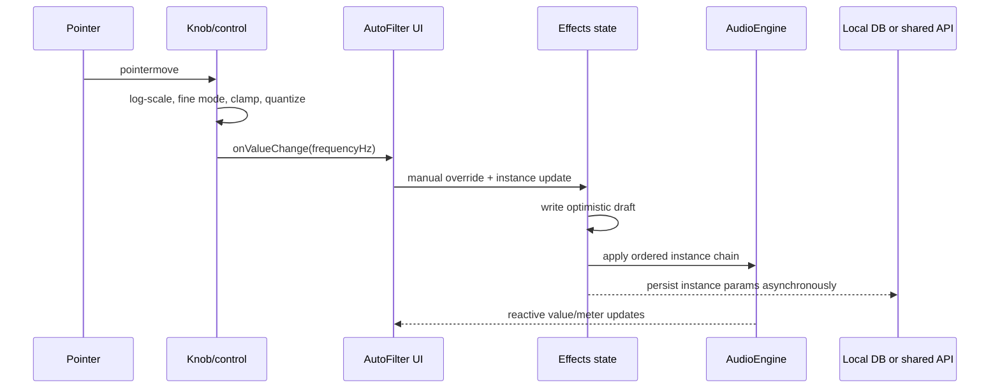

**What to notice:** the engine call and persistence request begin from the same normalized draft, but only the engine path is required for immediate audible feedback.

For this instance-keyed `updateInstance` path, persistence is invoked for each changed normalized value. The separate `createPersistedEffectState` helper supports a configurable debounce for state families that use it, but that debounce should not be incorrectly attributed to this effect-instance callback.

### What happens at pointer-up

`useDrag` removes the global listeners, clears the active pointer ID, removes the body selection class, and calls `onDragEnd`. `useSteppedValueControl` clears the temporary drag value, so the knob returns to rendering the reactive `props.value`. There is no separate commit event in `Knob` and no second audio update at pointer-up. The emitted values already updated the engine and queued persistence while the pointer was held.

This distinction matters when selection or ownership changes during a gesture. The current target and write guard are read by the effects-panel state owner for each update. A selection change can cause the panel to render another target, while an already active pointer gesture still has its own cleanup lifecycle. The owner must not infer persistence from the visual drag signal, and the engine synchronization hook must reconcile the newly selected target rather than leaving the old chain active.

### Engine synchronization

Reactive synchronization happens in:

```text
src/hooks/useEffectsPanelAudioSync.ts
```

It eventually calls:

```ts
audioEngine.setTrackFxInstances(trackId, instances)
```

`AudioEngine` delegates to:

```text
packages/audio-engine/src/live-mixer-runtime.ts
```

The runtime decides whether it should:

- Update parameters on an existing node.
- Reconfigure an existing worklet.
- Construct a new processor.
- Remove stale processors.
- Rebuild the effect chain.
- Recalculate plugin delay compensation.

The synchronization hook is:

```text
src/hooks/useEffectsPanelAudioSync.ts
```

It collects persisted and optimistic effect rows, normalizes and orders them, clears stale target state, and sends FX, instruments, automation, and sidechain state to the engine when the project or selected target changes. `AudioEngine` is intentionally a facade here:

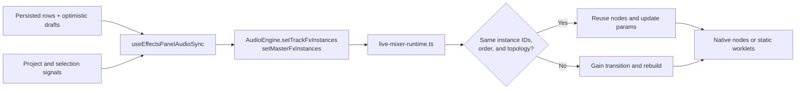

**What to notice:** stable identity allows inexpensive parameter reuse. A rebuild is reserved for changes to identity, order, or topology, and a stale build cannot replace a newer request.

Each chain is addressed by `instanceId`, not by effect kind. Therefore two compressors with the same kind remain distinct through parameter updates, automation, reorder, undo, and export.

### Worklet construction

The generic static-worklet integration lives in:

```text
packages/audio-engine/src/effects/static-worklet-chain.ts
packages/audio-engine/src/worklet-manifest.ts
packages/audio-engine/src/worklet-loader.ts
```

It maps the effect instance to a checked-in processor such as:

```text
public/audio-worklets/daw-spectral-processor-v1.js
```

Continuous parameters are normally delivered through `AudioParam`. Discrete configuration, reset, release, and health events use the worklet message port.

### Automation identity

Automation previously behaved like:

```text
track-1 → compressor → threshold
```

It now targets:

```text
track-1 → effect-instance-abc → compressor → threshold
```

This is required when one track contains multiple effects of the same kind.

The main contracts live in:

```text
packages/shared/src/automation.ts
packages/shared/src/automation-parameters.ts
src/hooks/useTimelineAutomationController.ts
```

`effectInstanceId` is optional for track and master parameters generally. It is mandatory when automation belongs to a specific effect instance, such as compressor threshold; mixer and instrument parameters use the track or master target without an effect instance ID.

### Live editing contract

Effect edits have two independent paths:

```text
Authorized UI edit
  ├── optimistic draft → AudioEngine immediately
  └── persistence request → local storage or shared operation
```

The instance update path makes the immediate branch explicit:

```ts
const next = normalizeParamsForKind(kind, updater(current));
if (areParamsForKindEqual(kind, current, next)) return;

writeDraftParams(targetId, instanceId, kind, next);
applyInstancesToEngine(targetId, orderedEffects());
commitInstanceParams(targetId, persistedInstanceId, kind, current, next);
void persistInstanceParams(targetId, persistedInstanceId, kind, next);
```

`applyInstancesToEngine` resolves the ordered chain using the optimistic draft and calls `setTrackFxInstances` or `setMasterFxInstances` before persistence completes. The write guard remains the only edit permission gate, so active playback and an audible reverb or delay tail do not block an authorized edit.

Continuous edits retain existing native nodes when their topology is unchanged. For example, an EQ band parameter update applies to the existing `BiquadFilterNode` array:

```ts
if (old && topologyMap.get(instanceId) === topologySignature) {
  applyEqNodeParams(old, normalized);
  signatureMap.set(instanceId, signature);
  return false;
}
```

Bypass and ordered topology changes use a short routing-gain transition instead of disconnecting an audible graph at full level:

```ts
reconnectWithGainRamp(nodes.postFx, ctx.currentTime, () => {
  disconnectAudioNodes([nodes.input]);
  connectFxChain(nodes.input, nodes.postFx, {
    instances: createInstanceStageConfigs(trackId, instances),
  });
});
```

Static processors also smooth their enabled-to-bypass transition in the worklet render loop. This keeps parameter edits immediate while making discrete changes click-safe. Persistence and history remain separate from the audio path, so a slow local or shared write cannot make the live controls feel unresponsive.

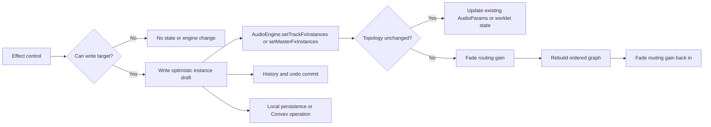

**What to notice:** permission is checked first. Parameter-only changes reuse running processors; structural changes briefly fade, rebuild, and fade back to avoid abrupt clicks.

### Local-first versus shared persistence

The effects-panel state chooses a persistence adapter from the project identity:

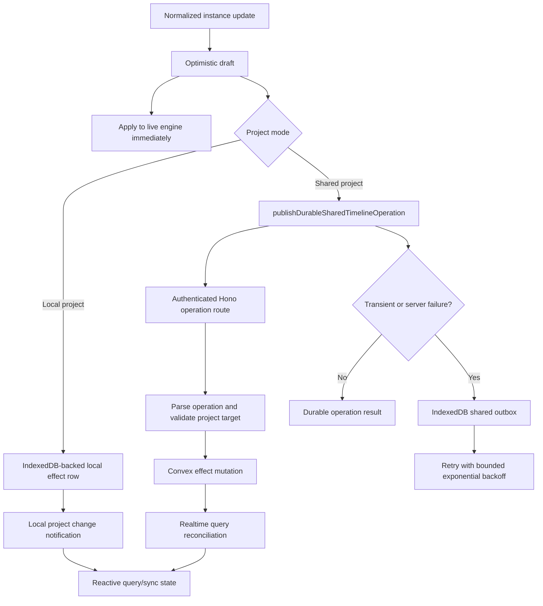

**What to notice:** local and shared projects use different durable destinations, but both begin with the same optimistic draft and immediate audio update. Only transient shared failures enter the retry outbox.

Local timeline writes use the repository's queued transaction path and lifecycle flushers. Shared operations that fail with retryable transport or server errors are stored in `src/lib/shared-outbox.ts` with status, attempt count, next-attempt time, and bounded retry delay. Validation errors are not silently converted into successful audio state.

## 3. Mixer, routing, and delay compensation

> **What you need to know:** Routing is a graph of connections, not just a list of volume sliders.
>
> **Why this exists:** Live playback and export need the same send, sidechain, channel, and timing decisions.
>
> **What can go wrong:** A nonexistent target, cycle, or unaligned parallel path can produce an invalid or phase-shifted result.
>
> **What the user experiences:** Sends and sidechains reach the intended destination without making parallel material arrive at different times.

Routing is now resolved as shared policy rather than independently assembled by playback and export.

Key files include:

```text
packages/audio-engine/src/mixer/resolve-routing.ts
packages/audio-engine/src/mixer/graph-contract.ts
packages/audio-engine/src/mixer/resolve-timing.ts
packages/audio-engine/src/mixer/apply-live-routing.ts
packages/audio-engine/src/mixer/apply-offline-routing.ts
```

### Resolved graph contents

The graph describes:

- Track and return channels.
- Mono or stereo layouts.
- Pre-FX sends.
- Pre-fader sends.
- Post-fader sends.
- Sidechain detector connections.
- Cue routing.
- Main output routing.
- Processor latency.
- Compensation delays.
- Final output layout.

### Delay compensation

Consider two parallel tracks:

```text
Track A → spectral processor → 2048-frame latency
Track B → no latent processor
```

Without compensation, Track B reaches the master first. Parallel material becomes phase-shifted.

The timing resolver aligns both routes:

```text
Track A: 2048 processing +    0 compensation
Track B:    0 processing + 2048 compensation
```

Live and offline routing consume the same timing policy.

The timing resolver builds a graph-level policy rather than delaying individual UI controls:

```mermaid
flowchart LR
  State["Tracks, sends, sidechains,<br/>effect instances"] --> Graph["resolveMixerGraph"]
  Graph --> Timing["resolveMixerTiming"]
  Timing --> Latency["Processor latency and path latency"]
  Timing --> Cycles["Cycle detection"]
  Timing --> PDC["Convergence compensation delays"]
  PDC --> Live["apply-live-routing"]
  PDC --> Offline["apply-offline-routing"]
```

**What to notice:** live playback and export consume one resolved routing and timing policy, so sends, sidechains, and latency alignment do not drift into two meanings.

Routing failures are rejected before an invalid sidechain or cycle becomes an audible graph. Sidechain edges are also checked against the compressor, gate, or spectral `effectInstanceId` that consumes them.

### Added routing semantics

The branch adds:

- Exact pre-FX, pre-fader, and post-fader send taps.
- External sidechains addressed by effect instance.
- Runtime-only cue routing.
- Sidechain source reachability during stem export.
- Explicit final-master mono downmix.

## 4. Production recording

> **What you need to know:** Long recordings are streams of bounded blocks, not one giant JavaScript array.
>
> **Why this exists:** Bounded transport and worker ownership protect responsiveness and make exact finalization possible.
>
> **What can go wrong:** Device removal, queue overrun, context failure, or a stuck writer can interrupt capture.
>
> **What the user experiences:** Recording either becomes a timeline clip or reports a bounded failure instead of hanging indefinitely.

Recording contains one of the largest replacements.

### Previous primary path

```text
MediaStream
  ↓
MediaRecorder
  ↓
Compressed browser-selected media file
```

This was simple, but provided limited control over exact sample boundaries, channel layout, continuity, overflow behavior, and output format.

### New primary path

```text
Record button
  ↓
useTrackRecording.ts
  ↓
AudioEngine.startRecordingCapture()
  ↓
MediaStreamAudioSourceNode
  ↓
Recorder AudioWorklet
  ↓
Transferable pool or gated SharedArrayBuffer ring
  ↓
Recording worker
  ↓
Framed planar PCM in OPFS
  ↓
Streaming WAV encoding
  ↓
Timeline asset and clip
```

Important files:

```text
src/hooks/useTrackRecording.ts
packages/audio-engine/src/recording/recording-runtime.ts
public/audio-worklets/daw-recorder-processor-v1.js
src/lib/recording/recording-transfer-transport.ts
src/lib/recording/recording-sab-transport.ts
src/workers/recording-writer-worker.ts
src/lib/recording/recording-temp-storage.ts
src/lib/recording/encode-recording-wav.ts
```

### Why OPFS and a worker exist

A long recording should not accumulate as one giant array in application memory.

Instead:

1. The worklet emits bounded PCM blocks.
2. A fixed transferable pool or SAB ring bounds transport memory.
3. A worker validates continuity.
4. Blocks are appended to temporary OPFS storage.
5. Finalization streams those blocks into WAV encoding.

Memory usage therefore depends primarily on block and queue limits, not recording duration.

### Shared audio context

Recording now uses the active playback `AudioContext`. This enables:

- Consistent frame-domain timing.
- Monitoring through track effects.
- Exact context-frame stop and punch boundaries.
- More predictable latency calibration.

### Retained fallback

`MediaRecorder` remains a labeled compressed fallback when production PCM capture cannot initialize.

## 5. Export pipeline

> **What you need to know:** Export is a separate offline render of a project snapshot, not a screen recording of playback.
>
> **Why this exists:** The file must include the intended effects, automation, routing, timing, and fidelity processing.
>
> **What can go wrong:** Missing media, unavailable offline DSP, non-finite audio, or encoding failure can invalidate the result.
>
> **What the user experiences:** Progress moves through clear stages, and an export either represents the project or fails visibly.

Export is now a staged, cancellable operation:

```text
Snapshot
  ↓
Preload assets
  ↓
Construct offline graph
  ↓
Render source plus bounded tail
  ↓
Analyze
  ↓
Normalize and/or true-peak limit
  ↓
Reanalyze
  ↓
Quantize and dither
  ↓
Encode
  ↓
Save or upload
```

Key files:

```text
src/components/timeline/ExportDialog.tsx
src/lib/export/run-export-job.ts
src/lib/export/process-rendered-export.ts
packages/audio-engine/src/export-mixdown.ts
packages/audio-engine/src/export-fidelity.ts
packages/audio-engine/src/export-encoding.ts
packages/audio-engine/src/loudness-analyzer.ts
```

### Live and offline parity

Offline rendering reconstructs:

- Ordered effect instances.
- Automation.
- Routing and send taps.
- Sidechains.
- Compensation delays.
- Sampler and granular instruments.
- Spectral and other static worklets.
- Track and master channel layouts.

Live and export failures intentionally differ:

- Live playback can sometimes preserve an audible dry path.
- Export rejects when required DSP cannot be constructed, because silently omitting an effect would generate an incorrect file.

### Export fidelity

New behavior includes:

- WAV 16-bit.
- WAV 24-bit.
- WAV 32-bit float.
- Deterministic TPDF dither for integer PCM.
- Sample-peak normalization.
- Integrated loudness normalization.
- True-peak limiting.
- Fixed and automatic tails.
- Explicit stem modes.
- Chunked encoding without another complete quantized buffer.

The loudness analyzer uses bounded rolling state and histograms instead of retaining the complete filtered program.

## 6. Automation identity and scheduling

Automation is a separate state family from effect parameters, but it shares the same ownership key. The target is conceptually:

```text
target kind + track or master + optional effectInstanceId + parameterId
```

For example:

```text
track vocal-1
  effect instance fx-compressor-a
    parameter thresholdDb
```

When automation belongs to an effect, the exact instance ID is required because effect order is not identity and two instances can have the same kind. Track and master parameters that are not owned by an effect instance omit it. `useTimelineAutomationController.ts` loads and normalizes envelopes, persists local or shared rows, schedules them from the playhead, and cancels the exact target's scheduled automation when a user makes a manual edit.

```mermaid
sequenceDiagram
  participant E as Envelope store
  participant V as Automation controller
  participant T as Transport/playhead
  participant P as Audio parameter target
  participant M as Manual knob

  E->>V: load normalized envelope
  T->>V: playhead and transport state
  V->>P: schedule target instance parameter
  M->>V: touch exact parameter
  V->>P: cancel/override exact target
  M->>P: apply current manual value
  V-->>E: persist envelope edits
```

**What to notice:** playback schedules saved points for one exact target. A manual touch cancels or overrides that same target, not every effect of the same kind.

Shared and Convex validation verify that the effect instance belongs to the project and target track or master. An envelope with an invalid identity is rejected or left unresolved according to the current validation contract, rather than being rebound to a same-kind effect by position.

## 7. New DSP processors

The branch introduces a common owned-processor model for application-controlled DSP.

New static processors include:

- Utility.
- Gate and expander.
- True-peak limiter.
- AutoFilter.
- Chorus.
- Flanger.
- Phaser.
- Tremolo.
- AutoPan.
- Ensemble.
- LoFi.
- Spectral.

Their UI lives under:

```text
src/components/effects/
```

Their checked-in DSP modules live under:

```text
public/audio-worklets/
```

Their canonical defaults, ranges, persistence versions, automation descriptors, and resource policies live in shared descriptors.

```text
Shared descriptor
  ├── persistence defaults
  ├── validation
  ├── UI ranges
  ├── automation descriptor
  ├── live parameter binding
  └── offline parameter binding
```

### Static worklets replace generated modules

The previous compressor generated an inline Blob-backed worklet module. It is replaced by a static, versioned asset.

Static assets improve:

- Content Security Policy compatibility.
- Module identity.
- Deployment reliability.
- Retry behavior.
- Testability.
- Fault reporting.
- Live and offline reuse.

## 8. Advanced sound design

### Sampler

```text
Sampler UI
  ↓
Versioned instrument state
  ↓
sampler-buffer-sync cache
  ↓
AudioEngine.setTrackSampler()
  ↓
sampler-runtime native buffer-source voices
```

Features include:

- Key zones.
- Velocity layers.
- Root-note mapping.
- Round robin.
- Loop and crossfade-loop modes.
- Amp and filter envelopes.
- LFO routing.
- Choke groups.
- Bounded polyphony and voice stealing.
- Preload and lazy cache policies.
- Stable instrument automation identity.

The browser cache is project-owned and bounded. Active voices pin their buffers so they cannot be evicted mid-note.

### Granular

Granular synthesis uses a worklet because grain scheduling must happen continuously in the audio rendering thread.

```text
Granular UI
  ↓
Decoded sample cache
  ↓
Transfer sample into granular worklet
  ↓
Preallocated grain pool
  ↓
Sample-accurate worklet parameters
```

It supports:

- Grain size and density.
- Position and spray.
- Pitch and reverse probability.
- Multiple window shapes.
- Stereo spread.
- Freeze.
- Deterministic seeded scheduling.
- Live and offline operation.

### Spectral

Spectral processing is an ordered effect instance.

It adds reusable FFT/STFT infrastructure and modes for:

- Freeze.
- Spectral gating.
- Sidechain morphing.
- Bin shifting and blur.
- Harmonic/percussive manipulation.
- Noise-profile reduction.

FFT size and overlap affect latency, so changing them triggers timing and compensation updates.

## 9. Undo, selection, and reactive ownership

> **What you need to know:** A selected track is a UI choice; it is not the identity of an audio node.
>
> **Why this exists:** Gestures, remote updates, undo, and engine state can overlap, so every write needs an explicit target.
>
> **What can go wrong:** A late gesture or restore could accidentally change a different track or effect if it used position alone.
>
> **What the user experiences:** Switching tracks does not make an in-progress edit jump to the wrong target, and undo restores connected state together.

### Selection and reactive ownership

The selected track is reactive UI ownership, not an audio-node identity. The engine owns chains by project target and stable effect instance ID. When selection changes:

1. Solid signals cause the effects panel and synchronization hook to re-read the new target.
2. The old target's optimistic drafts remain keyed to their original target and instance.
3. The sync hook clears stale target state where appropriate and applies the selected target's complete ordered chain.
4. An active drag finishes through `useDrag` cleanup; pointer cleanup is independent of selection rendering.
5. A write guard prevents edits when the current project or target is not writable.

This prevents a visual panel switch from accidentally retargeting a persistence write by effect kind or array index.

### Undo and redo

Parameter history records the target and effect instance identity. Larger operations use snapshots. Track deletion snapshots effects, automation, routing, inbound references, sidechains, and clips. Ungroup restoration validates those references before restoring local or shared state atomically.

```mermaid
flowchart TD
  Action["User action"] --> History["History entry with stable refs"]
  History --> Undo["Undo dispatcher"]
  Undo --> Restore["Restore effects, automation, routing,<br/>clips, and sidechains"]
  Restore --> Validate["Identity and ownership validation"]
  Validate --> Local["Local repository transaction"]
  Validate --> Shared["Shared Convex operation"]
  Local --> Reconcile["Reactive audio sync"]
  Shared --> Reconcile
  Reconcile --> Engine["AudioEngine graph"]
```

**What to notice:** history restores related state through local or shared persistence, then the existing reactive synchronization path brings the audio engine to that restored state.

## 10. Complexity and resource limits

> **What you need to know:** Big-O describes how work tends to grow as a collection grows. It does not promise a fixed number of milliseconds in a browser.
>
> **Why this exists:** Audio work has real-time and memory constraints, especially for long recordings and large projects.
>
> **What can go wrong:** A full graph rebuild, an unbounded queue, or repeated scans can cost more than a parameter-only update.
>
> **What the user experiences:** Small control changes feel immediate, while larger structural changes may require a deliberate rebuild or bounded wait.

### Complexity as a visual intuition

Imagine checking every effect in one chain:

```mermaid
flowchart LR
  Start["Start"] --> E1["Effect 1"]
  E1 --> E2["Effect 2"]
  E2 --> More["..."]
  More --> EN["Effect N"]
  EN --> Done["Done: one pass"]
```

**What to notice:** the diagram explains growth, not stopwatch time. Visiting twice as many effects is roughly twice as much list work, while a known single parameter can be updated directly.

If the chain has twice as many effects, one pass visits roughly twice as many items. That is the intuition behind `O(E)`. A knob update can be `O(1)` when it touches one known target. Routing resolution can be `O(T + R)` when it visits indexed tracks and routing edges once. These are shape descriptions, not claims that every browser operation has no hidden cost.

| Symbol | Meaning in this document | Beginner example |
| --- | --- | --- |
| `N` | A generic count of items when an example does not need a more specific name | Every item in a list |
| `T` | Tracks | Vocal, drums, bass |
| `E` | Effect instances in one chain | EQ, compressor, reverb |
| `R` | Routing edges | Track outputs and sends |
| `A` | Automation envelopes or targets | One envelope per automated parameter |
| `B` | Recording blocks | Small PCM chunks delivered to the writer |
| `C` | Audio channels | Mono is 1, stereo is 2 |
| `F` | Rendered audio frames | Samples across the export duration |
| `W` | Loaded worklet registry entries | One entry per loaded processor module |
| `S` | Snapshot entities | Tracks, clips, effects, and routes in an undo snapshot |

The following are the intended asymptotic shapes of the inspected paths. `T` is the number of tracks, `E` the number of effect instances in one chain, `R` the number of routing edges, `A` the number of automation envelopes, `B` the number of recording blocks, and `C` the number of audio channels.

| Path | Typical complexity | Space behavior | Practical limit or guard |
| --- | --- | --- | --- |
| Knob move | `O(1)` per emitted value | `O(1)` temporary drag state | Values are clamped and quantized; global listeners are removed on end/cancel |
| Effect draft update | `O(E)` for ordered chain application | `O(E)` chain snapshot | Each track/master chain is capped at 16 instances |
| Live chain reconciliation | `O(E)` for identity/topology comparison, plus graph rebuild work | `O(E)` live node state | Duplicate IDs are rejected; stale nodes are released |
| Worklet module lookup | Amortized `O(1)` per context after load | `O(W)` weak registry entries | Modules load once per `AudioContext`; faults transition the instance to bypass/closed state |
| Routing resolution | `O(T + R)` for indexed graph traversal | `O(T + R)` | Cycles and invalid targets are rejected |
| Timing/PDC resolution | `O(T + R)` for graph timing propagation in the resolved graph | `O(T + R)` | Compensation is bounded by the resolved graph and processor latency declarations |
| Automation scheduling | `O(A)` for a scheduling pass | `O(A)` envelope/target state | Targets must resolve to exact track/master and instance identity |
| Recording transport | `O(B)` over received blocks | `O(C * queueCapacity)` | Transfer pools and SAB rings are bounded; continuity, overrun, abort, and finalization timeout are explicit |
| Recording finalization | `O(B * C)` PCM traversal | `O(C * blockSize)` working memory | Framed OPFS storage avoids retaining the complete recording in JS memory |
| Export render | `O(F * E)` broadly, where `F` is rendered frames | Depends on renderer and bounded analysis state | Tail, worklet, asset, and cancellation policies are explicit |
| Loudness/fidelity analysis | `O(F * C)` | Bounded rolling state plus histograms | The complete filtered program is not retained for analysis |
| Undo snapshot restore | `O(S)` over snapshot entities | `O(S)` for the snapshot | Stable references and ownership validation precede restore |

These are architecture-level bounds, not claims that browser scheduling or Web Audio graph construction has zero hidden cost. The implementation uses `Map`/`Set` identity indexes and bounded queues where the hot paths require them. A full graph rebuild is deliberately more expensive than a parameter-only update and is used for topology, order, or identity changes.

## 11. Failure states and recovery

> **What you need to know:** “Pending,” “active,” and “failed” are different lifecycle states, not just different messages.
>
> **Why this exists:** Browser audio, workers, storage, and shared operations finish at different times.
>
> **What can go wrong:** A failure can happen after a newer request has already started, so stale work must not win.
>
> **What the user experiences:** The UI can show that work is building, active, safely bypassed, recovering, or failed without pretending that all states are success.

### Annotated lifecycle states

The same broad lifecycle appears in graph construction, recording, and export:

```mermaid
stateDiagram-v2
  [*] --> Normal
  Normal --> PendingBuilding: change or start
  PendingBuilding --> Active: resources ready
  PendingBuilding --> FailureFallback: build or device fails
  Active --> Normal: stop or stable update
  Active --> FailureFallback: runtime fault
  FailureFallback --> Recovery: retry or newer request
  Recovery --> Active: rebuild succeeds
  Recovery --> Normal: safe fallback retained
  FailureFallback --> Normal: operation ends visibly
```

**What to notice:** “pending” is not success, and “fallback” is not the requested processor working. The UI needs distinct states so users can tell whether work is preparing, active, recovering, or failed.

| State | Plain-language label | Example |
| --- | --- | --- |
| `Normal` | Nothing is currently rebuilding; the last valid state is usable. | Existing effect chain is playing |
| `PendingBuilding` | The system is preparing resources and the result is not active yet. | Loading a static worklet |
| `Active` | The requested path is running. | Recording blocks are reaching the writer |
| `FailureFallback` | The requested path failed; a safe fallback or explicit failure is active. | Live dry path remains, or export rejects |
| `Recovery` | The system is cleaning up and trying a newer or replacement path. | A newer chain revision replaces stale construction |

```mermaid
stateDiagram-v2
  [*] --> PendingBuilding
  PendingBuilding --> Active: context and graph ready
  Active --> FailureFallback: device or processor fault
  FailureFallback --> Recovery: release resources
  Recovery --> Active: retry succeeds
  Recovery --> FailureFallback: retry fails
```

**What to notice:** a retry is a new controlled attempt after cleanup. If it also fails, the system remains in an explicit fallback state instead of looping forever or claiming success.

For live playback, a dry path may remain useful while a failed effect is isolated. For export, the equivalent missing DSP is not silently skipped. That difference is a fidelity rule, not an inconsistency.

### What a person should see when something fails

| User activity | Visible explanation | Sound during the problem | Safe outcome |
| --- | --- | --- | --- |
| Editing an effect | The requested processor is building, bypassed, or failed, rather than simply looking active | Existing or dry audio can continue when the live policy permits | Failed instance is isolated and a newer valid request can recover |
| Routing or sidechain | The route was rejected and why, such as a missing target or cycle | Previous valid routing continues where rollback is supported | No invalid connection is guessed or partially applied |
| Recording | Capture stopped because of device loss, overrun, context fault, or finalization timeout | Monitoring is faded or stopped safely; unrelated playback behavior depends on the fault | Resources and temporary ownership are released; no incomplete clip is presented as finished |
| Export | The stage and cause are reported, such as preload, DSP construction, render analysis, or encoding | Live playback is a separate path and need not become the exported result | No success file is claimed when required sound is missing |
| Saving a shared edit | A transient operation can remain pending for bounded retry; validation or authorization rejection is shown as final | The optimistic live sound may continue while persistence reconciles | Retryable failures use the outbox; non-retryable failures are not endlessly queued |

The important product distinction is whether continuing audio is safe. Live editing can often preserve a useful previous or dry signal. Recording must stop safely when capture integrity is lost. Export must stop whenever continuing would produce a file that does not represent the project.

### Runtime, worklet, and identity failures

| Failure | Detection | Live behavior | Offline/export behavior |
| --- | --- | --- | --- |
| Static worklet module load or registration failure | Loader rejection or construction failure | Keep the prewired dry path where the runtime policy permits, report one bounded fault transition, and release the failed instance | Reject the export with processor and instance context |
| Worklet protocol fault or `processorerror` | Port validation or processor error event | Mark the instance faulted, reset meters/diagnostics, bypass or close the instance, and avoid repeated fault storms | Reject rather than silently omit required DSP |
| Duplicate effect instance ID | Chain validation | Refuse the invalid chain update | Refuse graph construction |
| Missing effect instance for automation | Shared/Convex/runtime identity validation | Do not schedule the unresolved target | Reject invalid required automation or report unresolved state |
| Stale async worklet construction | Revision check in live runtime | Newer chain revision wins; stale construction is closed | The offline graph uses the snapshot revision and fails visibly |

### Routing, sidechain, and transport failures

| Failure | Detection | Recovery |
| --- | --- | --- |
| Routing target does not exist | Resolved graph validation | Reject the operation before connecting nodes |
| Sidechain points at the wrong target instance | Compressor/gate/spectral identity validation | Reject the sidechain operation; do not guess by effect kind |
| Routing cycle | Timing/routing graph traversal | Reject the graph and keep the previous valid graph where the caller supports rollback |
| Recording device removal or context fault | Media track/context state checks | Stop capture, fade monitoring safely, preserve a bounded failure result, and avoid hanging finalization |
| Recording queue overrun | Transfer pool/SAB ring counters | Report overrun and fail or abort according to the recording runtime policy rather than silently dropping unknown frames |
| Recording finalization timeout | Bounded finalization timer | Terminate the writer path, report failure, and release stream, worker, worklet, and temporary storage ownership |

### Export and storage failures

| Failure | Detection | Recovery |
| --- | --- | --- |
| Missing asset or decode failure | Preload stage | Cancel/reject the job with the missing asset context |
| Required offline DSP unavailable | Offline worklet construction/render stage | Reject export; never claim success with the effect omitted |
| Invalid non-finite audio or fidelity result | Render analysis/reanalysis | Reject before encoding |
| Local write interruption | Repository transaction or pending-write flusher | Keep the optimistic state visible, retry/flush through the local persistence lifecycle, and surface a persistence error if it remains |
| Shared operation timeout, rate limit, or server failure | Hono operation result | Queue a durable outbox entry with attempt metadata and bounded exponential backoff |
| Shared validation/authentication failure | HTTP status and Convex validation | Do not queue as a transient retry; report the rejected operation |

The key rule is that an audible live fallback is not an export fallback. Playback may remain useful while a processor fault is isolated, but export must preserve fidelity or fail visibly.

## 12. Diagnostics and reliability

Important files:

```text
packages/audio-engine/src/runtime-diagnostics.ts
packages/audio-engine/src/reliability-characterization.ts
packages/audio-engine/src/browser-characterization.ts
src/routes/dsp-characterization.tsx
```

Diagnostics include:

- Requested versus active context settings.
- Browser-reported latency estimates.
- Graph and PDC latency.
- Recording transport state.
- Recorder overruns.
- Worklet fault event count.
- Unique fault signatures.
- Inferred application stalls.
- Recording calibration offset.
- Resource limits.

Characterization evidence is labeled as:

- Deterministic test.
- Production lifecycle test.
- Browser measured.
- Policy-only.
- Pending.
- Not evaluated.

This avoids presenting synthetic tests as proof of real-browser performance.

## 13. What is replaced?

### Replaced

| Deleted old path | Canonical replacement | Status |
| --- | --- | --- |
| Fixed `eq`, `compressor`, `saturator`, `delay`, and `reverb` graph fields | Required ordered `instances` arrays on track and master graphs | Deleted |
| `AudioEngine.setTrackEq`, `setTrackCompressor`, and other per-kind setters | `setTrackFxInstances(trackId, instances)` | Deleted |
| Per-kind master setters and master effect-order state | `setMasterFxInstances(instances)` | Deleted |
| Fixed-kind live and master node maps, pending params, and pending order | Instance-keyed live and master chain state | Deleted |
| `createLegacyStages` and instance-or-legacy chain construction | Instance-only chain construction | Deleted |
| Fixed-kind offline routing configuration | Required instance chains passed into offline routing | Deleted |
| `getLegacyEffectChainTiming` and fixed-kind PDC fallback | Timing derived from the same ordered instances used by the graph | Deleted |
| Synthetic `legacy-*` processor and meter IDs | Stable persisted effect instance IDs | Deleted |
| Kind-only automation lookup and old automation identity conversion | Target plus exact effect or instrument instance ID | Deleted |
| Legacy project and manifest normalization | Current schemas with required durable instance IDs | Deleted |

The canonical flow is now singular: persistence and the effects panel produce ordered instances, `AudioEngine` forwards those arrays, live and master runtimes own nodes by instance ID, automation resolves against the same ID, mixer timing derives PDC from the same order, and export constructs the offline graph from the same instance contracts.

- **Fixed-kind effect engine paths**
  Replaced by one canonical `instances` array per track and master chain.

- **Per-kind setters and fixed-kind ordering**
  Replaced by `setTrackFxInstances` and `setMasterFxInstances`, with ordering represented by array position.

- **Synthetic legacy node identities**
  Replaced by the persisted effect instance ID for every live and offline node.

- **Generated Blob compressor worklet**
  Replaced by static, versioned worklet assets.

- **Single effect-kind identity assumptions**
  Replaced by stable, ordered effect instances.

- **Primary compressed recording path**
  Replaced by bounded uncompressed PCM capture and streaming WAV.

- **Separate recording preview context**
  Replaced by shared-context recording and monitoring.

- **Simple offline mixdown orchestration**
  Replaced by graph-equivalent staged rendering and fidelity processing.

- **Effect-kind automation ownership**
  Replaced by exact effect and instrument instance ownership.

- **Implicit channel behavior**
  Replaced by explicit runtime mono and stereo semantics.

### Extended rather than replaced

- `AudioEngine` remains the UI-facing facade.
- `resolveMixerGraph` remains the central mixer policy.
- Native EQ, reverb, delay, saturation, gain, and convolution remain.
- MediaBunny remains the encoder and container integration.
- Local and Convex project models remain.
- The timeline, clips, and transport architecture remain.
- Undo and history remain, but support the new state.
- Existing effect kinds remain supported through their instance contracts.
- Existing post-fader sends remain the routing default.

### Retained fallbacks

- `MediaRecorder` remains available if PCM capture fails to initialize.
- Transferable recording remains available when SAB is unavailable.
- Browser capability fallbacks remain separate from the effect engine model. No legacy effect schema, fixed-kind setter, or legacy automation path is retained.

## 14. End-to-end production flows

The three production paths share explicit ownership and lifecycle boundaries, but they have different final sinks.

### Recording flow

```mermaid
flowchart LR
  Record["Record button"] --> Hook["useTrackRecording.ts"]
  Hook --> Engine["AudioEngine.startRecordingCapture"]
  Engine --> Source["MediaStreamAudioSourceNode"]
  Source --> Worklet["Recorder AudioWorklet"]
  Worklet --> Transport["Bounded transferable pool or SAB ring"]
  Transport --> Worker["Recording writer worker"]
  Worker --> OPFS["Framed PCM in OPFS"]
  OPFS --> WAV["Streaming WAV encoder"]
  WAV --> Asset["Timeline asset and clip"]
```

**What to notice:** total recording duration does not determine the in-memory queue size. The bounded transport and temporary storage carry blocks toward one finalized asset.

The bounded transport and worker keep recording memory independent of total duration. The active playback context supplies the frame-domain clock, while the fallback `MediaRecorder` path remains labeled as compressed capture when PCM initialization is unavailable.

### Export flow

```mermaid
flowchart TD
  Snapshot["Project snapshot"] --> Preload["Preload assets"]
  Preload --> Offline["Construct OfflineAudioContext graph"]
  Offline --> Render["Render source, effects, routing, and tail"]
  Render --> Analyze["Analyze loudness and peaks"]
  Analyze --> Process["Normalize or true-peak limit"]
  Process --> Reanalyze["Reanalyze processed render"]
  Reanalyze --> Quantize["Quantize and deterministic dither"]
  Quantize --> Encode["Encode WAV"]
  Encode --> Save["Save locally or upload export"]
```

**What to notice:** each stage has a distinct purpose and failure point. The file appears only after the snapshot has rendered, passed fidelity processing, and encoded successfully.

Offline rendering rejects missing required DSP rather than silently omitting an effect. Live playback can preserve a dry fallback for some runtime faults, but export must produce an accurate file or a visible failure.

## 15. Why is it so much code?

### Every feature crosses application layers

A processor is not complete when its DSP exists. It usually requires:

```text
Shared state type
Validation
Convex schema and operation
Local persistence
Undo and history
UI controls
Engine synchronization
Live node creation
Automation binding
Offline export
Resource cleanup
Tests
Characterization
```

### Live and export need parallel execution surfaces

The same project must work through:

- `AudioContext` during playback.
- `OfflineAudioContext` during export.

Routing, sidechains, automation, timing, instruments, and failures need explicit parity.

### Browser audio requires lifecycle ownership

The engine must handle:

- Asynchronous worklet registration.
- Context rebuilding.
- Rapid project switching.
- Stale asynchronous callbacks.
- Device removal.
- Worker termination.
- Buffer ownership.
- Exact final PCM blocks.
- Offline processor failure.
- Cleanup of nodes, ports, workers, streams, buffers, and listeners.

Much of the code prevents rare but severe leaks, hangs, or corrupted output.

### Current schemas are required

This branch intentionally has no legacy effect-engine, automation-identity, project-manifest, or local-preference migration layer. Persisted effects and instruments require durable instance IDs and current schemas. Invalid or incomplete state fails visibly instead of selecting an older engine or silently rendering without DSP.

Capability fallbacks are different from compatibility engines. `MediaRecorder` can take over when PCM capture cannot initialize, transferable recording works when `SharedArrayBuffer` is unavailable, repitch playback remains active while a stretch render is pending, and browser-specific defaults cover unavailable platform capabilities. Each fallback preserves the current data and engine model; none interprets an obsolete schema or runs a parallel DSP implementation.

### The branch includes proof code

The branch includes extensive tests covering:

- DSP numerical behavior.
- Persistence and current-schema validation.
- Timing and routing.
- Worker lifecycle.
- Cancellation.
- Bounded memory.
- Checked-in worklet behavior.
- Live and offline contracts.

## Rendering decision

The repository keeps this explainer as MDX rather than adding a generated HTML companion. The source already contains fenced Mermaid diagrams and ordinary Markdown tables, which keeps the architecture description reviewable beside the implementation. A separate HTML file would duplicate the content, create a second artifact to keep synchronized, and provide no additional validation target in this repository. If a publishing pipeline later requires static HTML, it should render this MDX source rather than become a second hand-maintained document.

## Summary

This branch does not replace the whole DAW. It preserves the timeline, project model, `AudioEngine` facade, mixer resolver, and existing native effects.

It replaces fragile assumptions beneath them:

- Singleton effects become stable instances.
- Implicit routing becomes a resolved graph.
- Uncompensated DSP becomes latency-aware.
- Compressed recording becomes bounded PCM capture.
- Basic export becomes a fidelity pipeline.
- Generated worklets become static deployable processors.
- Live-only behavior becomes live/offline behavior.
- Weak ownership becomes explicit lifecycle and resource ownership.

The codebase is larger because it now addresses production concerns across persistence, collaboration, playback, recording, export, diagnostics, and browser capability differences rather than only implementing audible DSP algorithms.
