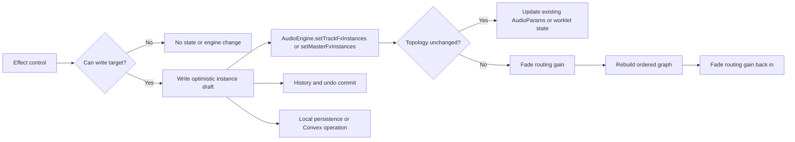
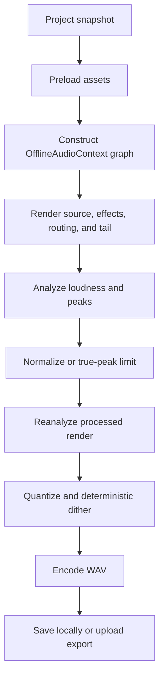

# Production DSP Platform Branch Explainer

This document explains what the `production-dsp-platform` branch adds, how the main systems work from the UI down to the audio engine, why the branch is large, and which existing paths it replaces or preserves.

## Branch scope

Compared with `origin/master`, the branch currently changes **227 files**, with **26,326 additions** and **2,734 deletions**.

The branch is not 20,000 lines of DSP algorithms. A substantial portion covers tests, persistence, collaboration, recording ownership, export fidelity, and browser characterization.

## System overview

```text
Solid UI
  ↓
Draft state, persistence, history, and collaboration
  ↓
AudioEngine facade
  ↓
Resolved mixer graph and timing policy
  ↓
Live AudioContext or OfflineAudioContext
  ↓
Native Web Audio nodes and static AudioWorklets
  ↓
Speakers, recording storage, or exported files
```

`AudioEngine` remains the application-facing facade. The major changes are beneath it: stable processor identity, explicit routing, delay compensation, bounded recording, live/offline parity, and versioned processor ownership.

## 1. Core architecture change

### Before

The original engine largely assumed:

- One effect of each kind per track.
- Automation identified by track and effect kind.
- Relatively simple track-to-master routing.
- Basic `MediaRecorder` recording.
- A simpler offline export path.
- Mostly native Web Audio effects.
- Limited latency, channel-layout, metering, and failure contracts.

Those assumptions become ambiguous when a project contains duplicate compressors, external sidechains, latent processors, pre-fader sends, sample-accurate recording, or offline AudioWorklets.

### After

The central model is now:

```text
Project state
  ↓
Stable effect and instrument instances
  ↓
Canonical resolved mixer graph
  ├── channel layouts
  ├── send tap points
  ├── sidechain edges
  ├── cue routing
  ├── processor timing
  └── delay compensation
       ↓
Live or offline graph adapter
```

The same graph policy drives live playback and offline export.

## 2. Effect UI to AudioWorklet

The Spectral effect is a representative example.

### UI

The controls live in:

```text
src/components/effects/Spectral.tsx
```

They expose FFT size, overlap, mode, freeze, gate, morphing, shifting, blur, noise reduction, mix, and sidechain configuration.

The component does not manipulate an `AudioNode` directly. It sends a normalized effect-instance update through the effects-panel state.

### State and persistence

The update passes through:

```text
src/components/timeline/create-effects-panel-audio-effects-state.ts
src/components/timeline/create-effects-panel-state.ts
```

This layer:

1. Updates the optimistic local draft.
2. applies it to the audio engine immediately.
3. Records history and undo state.
4. Persists locally or through Convex.
5. Preserves the stable effect-instance ID.

The same state must be represented across:

```text
packages/shared/src/effects-params.ts
convex/effects.ts
src/lib/local-effects.ts
src/lib/undo/
api/timeline-operation-executor.ts
```

This cross-layer representation is one major reason the branch is large.

### Engine synchronization

Reactive synchronization happens in:

```text
src/hooks/useEffectsPanelAudioSync.ts
```

It eventually calls:

```ts
audioEngine.setTrackFxInstances(trackId, instances)
```

`AudioEngine` delegates to:

```text
packages/audio-engine/src/live-mixer-runtime.ts
```

The runtime decides whether it should:

- Update parameters on an existing node.
- Reconfigure an existing worklet.
- Construct a new processor.
- Remove stale processors.
- Rebuild the effect chain.
- Recalculate plugin delay compensation.

### Worklet construction

The generic static-worklet integration lives in:

```text
packages/audio-engine/src/effects/static-worklet-chain.ts
packages/audio-engine/src/worklet-manifest.ts
packages/audio-engine/src/worklet-loader.ts
```

It maps the effect instance to a checked-in processor such as:

```text
public/audio-worklets/daw-spectral-processor-v1.js
```

Continuous parameters are normally delivered through `AudioParam`. Discrete configuration, reset, release, and health events use the worklet message port.

### Automation identity

Automation previously behaved like:

```text
track-1 → compressor → threshold
```

It now targets:

```text
track-1 → effect-instance-abc → compressor → threshold
```

This is required when one track contains multiple effects of the same kind.

The main contracts live in:

```text
packages/shared/src/automation.ts
packages/shared/src/automation-parameters.ts
src/hooks/useTimelineAutomationController.ts
```

Automation is instance-only. An automation target without an effect instance ID is not accepted by the runtime.

### Live editing contract

Effect edits have two independent paths:

```text
Authorized UI edit
  ├── optimistic draft → AudioEngine immediately
  └── persistence request → local storage or shared operation
```

The instance update path makes the immediate branch explicit:

```ts
const next = normalizeParamsForKind(kind, updater(current));
if (areParamsForKindEqual(kind, current, next)) return;

writeDraftParams(targetId, instanceId, kind, next);
applyInstancesToEngine(targetId, orderedEffects());
commitInstanceParams(targetId, persistedInstanceId, kind, current, next);
void persistInstanceParams(targetId, persistedInstanceId, kind, next);
```

`applyInstancesToEngine` resolves the ordered chain using the optimistic draft and calls `setTrackFxInstances` or `setMasterFxInstances` before persistence completes. The write guard remains the only edit permission gate, so active playback and an audible reverb or delay tail do not block an authorized edit.

Continuous edits retain existing native nodes when their topology is unchanged. For example, an EQ band parameter update applies to the existing `BiquadFilterNode` array:

```ts
if (old && topologyMap.get(instanceId) === topologySignature) {
  applyEqNodeParams(old, normalized);
  signatureMap.set(instanceId, signature);
  return false;
}
```

Bypass and ordered topology changes use a short routing-gain transition instead of disconnecting an audible graph at full level:

```ts
reconnectWithGainRamp(nodes.postFx, ctx.currentTime, () => {
  disconnectAudioNodes([nodes.input]);
  connectFxChain(nodes.input, nodes.postFx, {
    instances: createInstanceStageConfigs(trackId, instances),
  });
});
```

Static processors also smooth their enabled-to-bypass transition in the worklet render loop. This keeps parameter edits immediate while making discrete changes click-safe. Persistence and history remain separate from the audio path, so a slow local or shared write cannot make the live controls feel unresponsive.



## 3. Mixer, routing, and delay compensation

Routing is now resolved as shared policy rather than independently assembled by playback and export.

Key files include:

```text
packages/audio-engine/src/mixer/resolve-routing.ts
packages/audio-engine/src/mixer/graph-contract.ts
packages/audio-engine/src/mixer/resolve-timing.ts
packages/audio-engine/src/mixer/apply-live-routing.ts
packages/audio-engine/src/mixer/apply-offline-routing.ts
```

### Resolved graph contents

The graph describes:

- Track and return channels.
- Mono or stereo layouts.
- Pre-FX sends.
- Pre-fader sends.
- Post-fader sends.
- Sidechain detector connections.
- Cue routing.
- Main output routing.
- Processor latency.
- Compensation delays.
- Final output layout.

### Delay compensation

Consider two parallel tracks:

```text
Track A → spectral processor → 2048-frame latency
Track B → no latent processor
```

Without compensation, Track B reaches the master first. Parallel material becomes phase-shifted.

The timing resolver aligns both routes:

```text
Track A: 2048 processing +    0 compensation
Track B:    0 processing + 2048 compensation
```

Live and offline routing consume the same timing policy.

### Added routing semantics

The branch adds:

- Exact pre-FX, pre-fader, and post-fader send taps.
- External sidechains addressed by effect instance.
- Runtime-only cue routing.
- Sidechain source reachability during stem export.
- Explicit final-master mono downmix.

## 4. Production recording

Recording contains one of the largest replacements.

### Previous primary path

```text
MediaStream
  ↓
MediaRecorder
  ↓
Compressed browser-selected media file
```

This was simple, but provided limited control over exact sample boundaries, channel layout, continuity, overflow behavior, and output format.

### New primary path

```text
Record button
  ↓
useTrackRecording.ts
  ↓
AudioEngine.startRecordingCapture()
  ↓
MediaStreamAudioSourceNode
  ↓
Recorder AudioWorklet
  ↓
Transferable pool or gated SharedArrayBuffer ring
  ↓
Recording worker
  ↓
Framed planar PCM in OPFS
  ↓
Streaming WAV encoding
  ↓
Timeline asset and clip
```

Important files:

```text
src/hooks/useTrackRecording.ts
packages/audio-engine/src/recording/recording-runtime.ts
public/audio-worklets/daw-recorder-processor-v1.js
src/lib/recording/recording-transfer-transport.ts
src/lib/recording/recording-sab-transport.ts
src/workers/recording-writer-worker.ts
src/lib/recording/recording-temp-storage.ts
src/lib/recording/encode-recording-wav.ts
```

### Why OPFS and a worker exist

A long recording should not accumulate as one giant array in application memory.

Instead:

1. The worklet emits bounded PCM blocks.
2. A fixed transferable pool or SAB ring bounds transport memory.
3. A worker validates continuity.
4. Blocks are appended to temporary OPFS storage.
5. Finalization streams those blocks into WAV encoding.

Memory usage therefore depends primarily on block and queue limits, not recording duration.

### Shared audio context

Recording now uses the active playback `AudioContext`. This enables:

- Consistent frame-domain timing.
- Monitoring through track effects.
- Exact context-frame stop and punch boundaries.
- More predictable latency calibration.

### Retained fallback

`MediaRecorder` remains a labeled compressed fallback when production PCM capture cannot initialize.

## 5. Export pipeline

Export is now a staged, cancellable operation:

```text
Snapshot
  ↓
Preload assets
  ↓
Construct offline graph
  ↓
Render source plus bounded tail
  ↓
Analyze
  ↓
Normalize and/or true-peak limit
  ↓
Reanalyze
  ↓
Quantize and dither
  ↓
Encode
  ↓
Save or upload
```

Key files:

```text
src/components/timeline/ExportDialog.tsx
src/lib/export/run-export-job.ts
src/lib/export/process-rendered-export.ts
packages/audio-engine/src/export-mixdown.ts
packages/audio-engine/src/export-fidelity.ts
packages/audio-engine/src/export-encoding.ts
packages/audio-engine/src/loudness-analyzer.ts
```

### Live and offline parity

Offline rendering reconstructs:

- Ordered effect instances.
- Automation.
- Routing and send taps.
- Sidechains.
- Compensation delays.
- Sampler and granular instruments.
- Spectral and other static worklets.
- Track and master channel layouts.

Live and export failures intentionally differ:

- Live playback can sometimes preserve an audible dry path.
- Export rejects when required DSP cannot be constructed, because silently omitting an effect would generate an incorrect file.

### Export fidelity

New behavior includes:

- WAV 16-bit.
- WAV 24-bit.
- WAV 32-bit float.
- Deterministic TPDF dither for integer PCM.
- Sample-peak normalization.
- Integrated loudness normalization.
- True-peak limiting.
- Fixed and automatic tails.
- Explicit stem modes.
- Chunked encoding without another complete quantized buffer.

The loudness analyzer uses bounded rolling state and histograms instead of retaining the complete filtered program.

## 6. New DSP processors

The branch introduces a common owned-processor model for application-controlled DSP.

New static processors include:

- Utility.
- Gate and expander.
- True-peak limiter.
- AutoFilter.
- Chorus.
- Flanger.
- Phaser.
- Tremolo.
- AutoPan.
- Ensemble.
- LoFi.
- Spectral.

Their UI lives under:

```text
src/components/effects/
```

Their checked-in DSP modules live under:

```text
public/audio-worklets/
```

Their canonical defaults, ranges, persistence versions, automation descriptors, and resource policies live in shared descriptors.

```text
Shared descriptor
  ├── persistence defaults
  ├── validation
  ├── UI ranges
  ├── automation descriptor
  ├── live parameter binding
  └── offline parameter binding
```

### Static worklets replace generated modules

The previous compressor generated an inline Blob-backed worklet module. It is replaced by a static, versioned asset.

Static assets improve:

- Content Security Policy compatibility.
- Module identity.
- Deployment reliability.
- Retry behavior.
- Testability.
- Fault reporting.
- Live and offline reuse.

## 7. Advanced sound design

### Sampler

```text
Sampler UI
  ↓
Versioned instrument state
  ↓
sampler-buffer-sync cache
  ↓
AudioEngine.setTrackSampler()
  ↓
sampler-runtime native buffer-source voices
```

Features include:

- Key zones.
- Velocity layers.
- Root-note mapping.
- Round robin.
- Loop and crossfade-loop modes.
- Amp and filter envelopes.
- LFO routing.
- Choke groups.
- Bounded polyphony and voice stealing.
- Preload and lazy cache policies.
- Stable instrument automation identity.

The browser cache is project-owned and bounded. Active voices pin their buffers so they cannot be evicted mid-note.

### Granular

Granular synthesis uses a worklet because grain scheduling must happen continuously in the audio rendering thread.

```text
Granular UI
  ↓
Decoded sample cache
  ↓
Transfer sample into granular worklet
  ↓
Preallocated grain pool
  ↓
Sample-accurate worklet parameters
```

It supports:

- Grain size and density.
- Position and spray.
- Pitch and reverse probability.
- Multiple window shapes.
- Stereo spread.
- Freeze.
- Deterministic seeded scheduling.
- Live and offline operation.

### Spectral

Spectral processing is an ordered effect instance.

It adds reusable FFT/STFT infrastructure and modes for:

- Freeze.
- Spectral gating.
- Sidechain morphing.
- Bin shifting and blur.
- Harmonic/percussive manipulation.
- Noise-profile reduction.

FFT size and overlap affect latency, so changing them triggers timing and compensation updates.

## 8. Diagnostics and reliability

Important files:

```text
packages/audio-engine/src/runtime-diagnostics.ts
packages/audio-engine/src/reliability-characterization.ts
packages/audio-engine/src/browser-characterization.ts
src/routes/dsp-characterization.tsx
```

Diagnostics include:

- Requested versus active context settings.
- Browser-reported latency estimates.
- Graph and PDC latency.
- Recording transport state.
- Recorder overruns.
- Worklet fault event count.
- Unique fault signatures.
- Inferred application stalls.
- Recording calibration offset.
- Resource limits.

Characterization evidence is labeled as:

- Deterministic test.
- Production lifecycle test.
- Browser measured.
- Policy-only.
- Pending.
- Not evaluated.

This avoids presenting synthetic tests as proof of real-browser performance.

## 9. What is replaced?

### Replaced

| Deleted old path | Canonical replacement | Status |
| --- | --- | --- |
| Fixed `eq`, `compressor`, `saturator`, `delay`, and `reverb` graph fields | Required ordered `instances` arrays on track and master graphs | Deleted |
| `AudioEngine.setTrackEq`, `setTrackCompressor`, and other per-kind setters | `setTrackFxInstances(trackId, instances)` | Deleted |
| Per-kind master setters and master effect-order state | `setMasterFxInstances(instances)` | Deleted |
| Fixed-kind live and master node maps, pending params, and pending order | Instance-keyed live and master chain state | Deleted |
| `createLegacyStages` and instance-or-legacy chain construction | Instance-only chain construction | Deleted |
| Fixed-kind offline routing configuration | Required instance chains passed into offline routing | Deleted |
| `getLegacyEffectChainTiming` and fixed-kind PDC fallback | Timing derived from the same ordered instances used by the graph | Deleted |
| Synthetic `legacy-*` processor and meter IDs | Stable persisted effect instance IDs | Deleted |
| Kind-only automation lookup and old automation identity conversion | Target plus exact effect or instrument instance ID | Deleted |
| Legacy project and manifest normalization | Current schemas with required durable instance IDs | Deleted |

The canonical flow is now singular: persistence and the effects panel produce ordered instances, `AudioEngine` forwards those arrays, live and master runtimes own nodes by instance ID, automation resolves against the same ID, mixer timing derives PDC from the same order, and export constructs the offline graph from the same instance contracts.

- **Fixed-kind effect engine paths**
  Replaced by one canonical `instances` array per track and master chain.

- **Per-kind setters and fixed-kind ordering**
  Replaced by `setTrackFxInstances` and `setMasterFxInstances`, with ordering represented by array position.

- **Synthetic legacy node identities**
  Replaced by the persisted effect instance ID for every live and offline node.

- **Generated Blob compressor worklet**
  Replaced by static, versioned worklet assets.

- **Single effect-kind identity assumptions**
  Replaced by stable, ordered effect instances.

- **Primary compressed recording path**
  Replaced by bounded uncompressed PCM capture and streaming WAV.

- **Separate recording preview context**
  Replaced by shared-context recording and monitoring.

- **Simple offline mixdown orchestration**
  Replaced by graph-equivalent staged rendering and fidelity processing.

- **Effect-kind automation ownership**
  Replaced by exact effect and instrument instance ownership.

- **Implicit channel behavior**
  Replaced by explicit runtime mono and stereo semantics.

### Extended rather than replaced

- `AudioEngine` remains the UI-facing facade.
- `resolveMixerGraph` remains the central mixer policy.
- Native EQ, reverb, delay, saturation, gain, and convolution remain.
- MediaBunny remains the encoder and container integration.
- Local and Convex project models remain.
- The timeline, clips, and transport architecture remain.
- Undo and history remain, but support the new state.
- Existing effect kinds remain supported through their instance contracts.
- Existing post-fader sends remain the routing default.

### Retained fallbacks

- `MediaRecorder` remains available if PCM capture fails to initialize.
- Transferable recording remains available when SAB is unavailable.
- Browser capability fallbacks remain separate from the effect engine model. No legacy effect schema, fixed-kind setter, or legacy automation path is retained.

## 10. End-to-end production flows

The three production paths share explicit ownership and lifecycle boundaries, but they have different final sinks.

### Recording flow


The bounded transport and worker keep recording memory independent of total duration. The active playback context supplies the frame-domain clock, while the fallback `MediaRecorder` path remains labeled as compressed capture when PCM initialization is unavailable.

### Export flow



Offline rendering rejects missing required DSP rather than silently omitting an effect. Live playback can preserve a dry fallback for some runtime faults, but export must produce an accurate file or a visible failure.

## 11. Why is it so much code?

### Every feature crosses application layers

A processor is not complete when its DSP exists. It usually requires:

```text
Shared state type
Validation
Convex schema and operation
Local persistence
Undo and history
UI controls
Engine synchronization
Live node creation
Automation binding
Offline export
Resource cleanup
Tests
Characterization
```

### Live and export need parallel execution surfaces

The same project must work through:

- `AudioContext` during playback.
- `OfflineAudioContext` during export.

Routing, sidechains, automation, timing, instruments, and failures need explicit parity.

### Browser audio requires lifecycle ownership

The engine must handle:

- Asynchronous worklet registration.
- Context rebuilding.
- Rapid project switching.
- Stale asynchronous callbacks.
- Device removal.
- Worker termination.
- Buffer ownership.
- Exact final PCM blocks.
- Offline processor failure.
- Cleanup of nodes, ports, workers, streams, buffers, and listeners.

Much of the code prevents rare but severe leaks, hangs, or corrupted output.

### Current schemas are required

This branch intentionally has no legacy effect-engine, automation-identity, project-manifest, or local-preference migration layer. Persisted effects and instruments require durable instance IDs and current schemas. Invalid or incomplete state fails visibly instead of selecting an older engine or silently rendering without DSP.

Capability fallbacks are different from compatibility engines. `MediaRecorder` can take over when PCM capture cannot initialize, transferable recording works when `SharedArrayBuffer` is unavailable, repitch playback remains active while a stretch render is pending, and browser-specific defaults cover unavailable platform capabilities. Each fallback preserves the current data and engine model; none interprets an obsolete schema or runs a parallel DSP implementation.

### The branch includes proof code

The branch includes extensive tests covering:

- DSP numerical behavior.
- Persistence and current-schema validation.
- Timing and routing.
- Worker lifecycle.
- Cancellation.
- Bounded memory.
- Checked-in worklet behavior.
- Live and offline contracts.

## Summary

This branch does not replace the whole DAW. It preserves the timeline, project model, `AudioEngine` facade, mixer resolver, and existing native effects.

It replaces fragile assumptions beneath them:

- Singleton effects become stable instances.
- Implicit routing becomes a resolved graph.
- Uncompensated DSP becomes latency-aware.
- Compressed recording becomes bounded PCM capture.
- Basic export becomes a fidelity pipeline.
- Generated worklets become static deployable processors.
- Live-only behavior becomes live/offline behavior.
- Weak ownership becomes explicit lifecycle and resource ownership.

The codebase is larger because it now addresses production concerns across persistence, collaboration, playback, recording, export, diagnostics, and browser capability differences rather than only implementing audible DSP algorithms.
